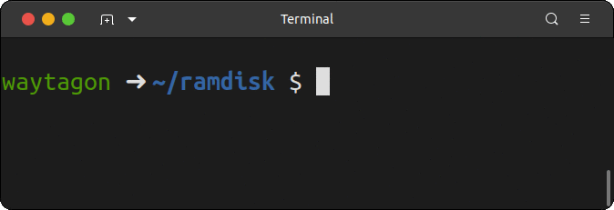

# wake-up-neo

[](https://crates.io/crates/wake_up_neo)


Simulates the hacked terminal from "The Matrix"

## demo



## usage

```
Simulates the hacked terminal from "The Matrix"

Usage: wake_up_neo [OPTIONS]

Options:
  -n, --name <NAME>          name used in message. (Default "Neo")
  -m, --message <MESSAGE>    message to print to console
  -c, --color <COLOR>        character color [possible values: black, red, green, yellow, blue, magenta, cyan, white]
  -b, --bg-color <BG_COLOR>  background color [possible values: black, red, green, yellow, blue, magenta, cyan, white]
  -i, --ignore-ctrlc         Ignore Ctrl-C (SIGINT)
  -h, --help                 Print help
  -V, --version              Print version
```

## License

This software is provided under the MIT license and the Apache License (Version 2.0).
